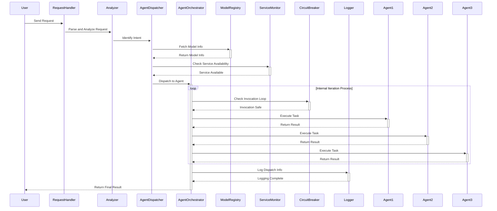
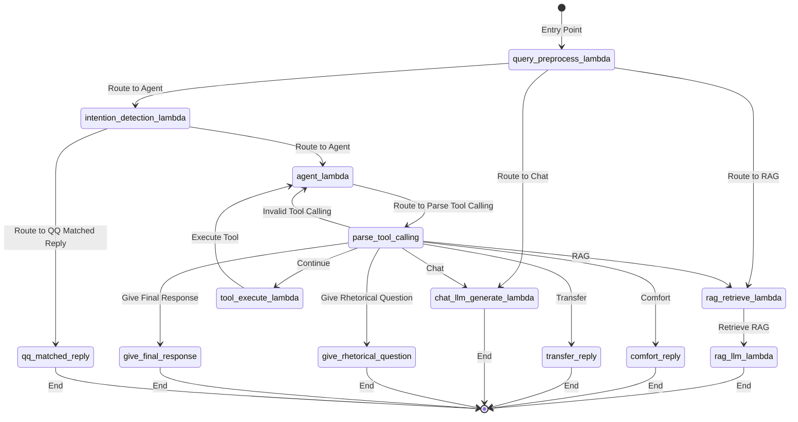
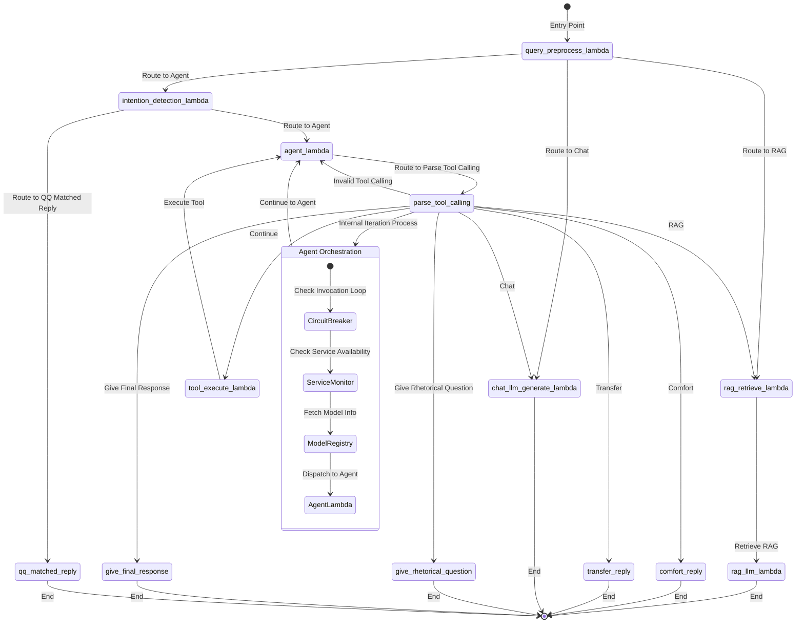
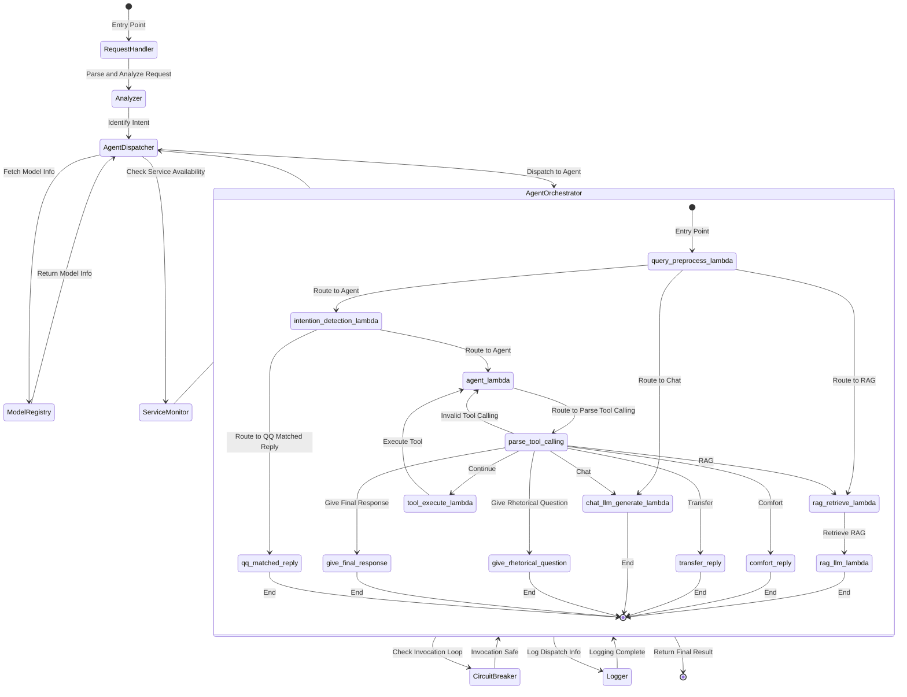

## TODO

- Agent Router for Large Language Model (LLM) to handle & analze user request then dispatch & orchestrate to difference agent (tool sets) to complete the user request automatically, in consideration of *business*, including model ability (e.g. maximum input token/latency/task competency), inference cost and service availability; *operation* including dispatch log for resource monitoring & user insights, early existing (circuit break) for infinite agent invocation loop.

### Core Modules
- Request Handler: Receives and parses user requests.
- Analyzer: Analyzes the request to understand the user's intent and requirements.
- Agent Dispatcher: Dispatches the request to the appropriate agent (tool set) based on the analysis.
- Agent Orchestrator: Manages the execution of tasks by different agents, ensuring they work together seamlessly.
- ModelRegistry: Maintains a registry of available models and their capabilities, such as maximum input tokens, latency, task competency, and cost.
- Service Monitor: Monitors the availability and health of the agents and models.
- Circuit Breaker: Monitors and breaks infinite invocation loops.

### Overall Architecture


Existing RAG online workflow:

Option 1:
Add model registry, Service Monitor and Circuit Breaker only in existing workflow


Option 2:
Combine both workflow sequentially 


Sample code for new Agent Router:
```python
from langchain import LangGraph
from langchain.agents import Agent, Tool

class RequestHandler:
    def parse_request(self, request):
        # Parse the user request
        return request

class Analyzer:
    def analyze(self, parsed_request):
        # Analyze the request to understand intent and requirements
        intent = "determine_intent_based_on_request"
        return intent, parsed_request

class AgentDispatcher:
    def dispatch(self, intent, parsed_request):
        # Dispatch the request to the appropriate agent based on intent
        if intent == "generate_image":
            return [DalleTool(parsed_request)]
        elif intent == "search_web":
            return [WebAccessTool(parsed_request)]
        elif intent == "create_mindmap":
            return [MindMapTool(parsed_request)]
        elif intent == "create_diagram":
            return [MermaidDiagramTool(parsed_request)]
        else:
            raise ValueError("Unknown intent")

class AgentOrchestrator:
    def __init__(self, circuit_breaker, logger):
        self.circuit_breaker = circuit_breaker
        self.logger = logger

    def orchestrate(self, tools):
        results = []
        for tool in tools:
            self.circuit_breaker.check()
            result = tool.execute()
            results.append(result)
            self.logger.log(f"Executed {tool.__class__.__name__} with result: {result}")
        return results

class ModelRegistry:
    def __init__(self):
        self.models = {}

    def register_model(self, model_name, model_info):
        # Register a model with its capabilities
        self.models[model_name] = model_info

    def get_model(self, task):
        # Get the appropriate model for a given task
        # This is a simplified example, real logic will depend on model_info
        for model_name, model_info in self.models.items():
            if model_info['task'] == task:
                return model_name
        raise ValueError("No suitable model found")

class ServiceMonitor:
    def monitor(self, service):
        # Monitor the availability and health of a service
        pass

class Logger:
    def log(self, message):
        # Log the message for resource monitoring and user insights
        print(f"Log: {message}")

class CircuitBreaker:
    def __init__(self, threshold):
        self.threshold = threshold
        self.count = 0

    def check(self):
        self.count += 1
        if self.count >= self.threshold:
            # Break the loop if the threshold is reached
            raise Exception("Infinite agent invocation loop detected")

class AgentRouter:
    def __init__(self):
        self.request_handler = RequestHandler()
        self.analyzer = Analyzer()
        self.agent_dispatcher = AgentDispatcher()
        self.model_registry = ModelRegistry()
        self.service_monitor = ServiceMonitor()
        self.logger = Logger()
        self.circuit_breaker = CircuitBreaker(threshold=10)
        self.agent_orchestrator = AgentOrchestrator(self.circuit_breaker, self.logger)

    def handle_request(self, request):
        parsed_request = self.request_handler.parse_request(request)
        intent, parsed_request = self.analyzer.analyze(parsed_request)
        tools = self.agent_dispatcher.dispatch(intent, parsed_request)
        result = self.agent_orchestrator.orchestrate(tools)
        
        self.logger.log({"request": request, "intent": intent, "result": result})
        
        return result

# Example Tool Classes
class DalleTool(Tool):
    def __init__(self, input_data):
        self.input_data = input_data

    def execute(self):
        # Execute the task using Dalle
        return f"Generated Image with input: {self.input_data}"

class WebAccessTool(Tool):
    def __init__(self, input_data):
        self.input_data = input_data

    def execute(self):
        # Execute the task using Web Access
        return f"Web Accessed with input: {self.input_data}"

class MindMapTool(Tool):
    def __init__(self, input_data):
        self.input_data = input_data

    def execute(self):
        # Execute the task using Mind Map
        return f"Mind Map created with input: {self.input_data}"

class MermaidDiagramTool(Tool):
    def __init__(self, input_data):
        self.input_data = input_data

    def execute(self):
        # Execute the task using Mermaid Diagram
        return f"Diagram created with input: {self.input_data}"

# Example usage
if __name__ == "__main__":
    agent_router = AgentRouter()
    user_input = "Create a mind map for project planning"
    response = agent_router.handle_request(user_input)
    print(response)
```
