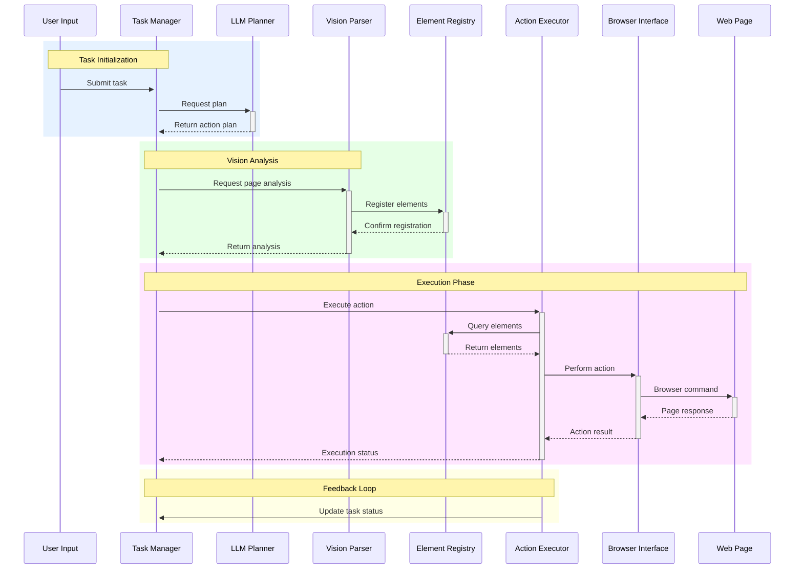

# Web Agent Framework Design Document

## 1. Overview

The Web Agent Framework is designed to automate web interactions by combining computer vision and semantic understanding. It processes web interfaces through a multi-model approach:
- YOLO-based element detection
- OCR text recognition (EasyOCR)
- Visual semantic understanding (BLIP2/Florence2)
- Large Language Model (LLM) for task planning and execution

Core capabilities:
- Visual element detection & localization and text extraction & semantic understanding
- Element state tracking and validation

## 2. System Architecture

### 2.1 High-Level Architecture Flow



### 2.2 Core Components

1. **Task Manager**
   - Handles user input processing
   - Maintains task state and progress
   - Coordinates between components

2. **LLM Planner**
   - Analyzes user intentions
   - Breaks down tasks into actionable steps
   - Generates interaction strategies

3. **Vision Parser**
   - Integrates OCR and caption models
   - Detects interactive elements
   - Maps semantic meaning to visual elements

4. **Element Registry**
   - Maintains element state and properties
   - Provides element lookup and validation
   - Tracks interaction history

5. **Action Executor**
   - Translates planned actions into browser commands
   - Handles element interactions
   - Manages timing and synchronization


## 3. Data Structures

### 3.1 Task and Action Step Data Structures
```python
class Task:
    def init(self):
        self.id: str
        self.description: str
        self.status: TaskStatus
        self.steps: List[ActionStep]
        self.context: Dict[str, Any]
        self.created_at: datetime
        self.updated_at: datetime
class ActionStep:
    def init(self):
        self.action_type: ActionType
        self.target: ElementTarget
        self.parameters: Dict[str, Any]
        self.status: StepStatus
        self.retry_count: int
```

### 3.2 Web Element Data Structure
```python
class WebElement:
    def __init__(self):
        # Core properties
        self.id: str  # Unique identifier
        self.element_type: ElementType  # Button, input, text etc
        self.selector: ElementTarget  # How to locate this element
        
        # Visual properties
        self.bounding_box: BoundingBox  # Position and size
        self.is_visible: bool  # Whether element is currently visible
        
        # Semantic properties  
        self.semantic_description: str  # Natural language description
        self.attributes: Dict[str, str]  # HTML attributes like text, href
        self.state: ElementState  # Enabled, disabled, selected etc
        
        # Detection metadata
        self.confidence: float  # Detection confidence (0-1)
        self.last_updated: datetime  # When element was last seen/updated

### 3.3 Action Execution Data Structure

```python
class ElementTarget:
    def __init__(self):
        self.selector_type: str  # 'semantic', 'coordinates', 'ocr'
        self.value: Union[str, List[float]]  # Target identifier or coordinates
        self.confidence_threshold: float  # Minimum confidence for matching
        self.context: Dict[str, Any]  # Additional targeting context

class ActionParameters:
    def __init__(self):
        self.input_text: Optional[str]  # For TYPE actions
        self.scroll_amount: Optional[int]  # For SCROLL actions
        self.wait_time: Optional[float]  # Time to wait after action
        self.validation_check: Optional[Callable]  # Post-action validation

class ActionResult:
    def __init__(self):
        self.success: bool  # Whether action completed successfully
        self.element_id: Optional[str]  # ID of affected element
        self.timestamp: datetime  # When action was executed
        self.error: Optional[Exception]  # Error if action failed
        self.execution_time: float  # Time taken to execute
        self.validation_result: Optional[bool]  # Result of validation check

class ActionContext:
    def __init__(self):
        self.page_state: Dict[str, Any]  # Current page state
        self.previous_actions: List[ActionResult]  # Action history
        self.available_elements: List[str]  # Currently available elements
        self.retry_count: int  # Number of retries for current action
```

## 4. Key Workflows

### 4.1 Task Initialization

Briefly:
- User submits a task description
- Task manager initializes a task and sends it to the LLM planner
- LLM planner generates an action plan and sends it back to the task manager

#### 4.1.1 Action Types

```python
from enum import Enum
class ActionType(Enum):
    CLICK = "click"
    TYPE = "type"
    SCROLL = "scroll"
    HOVER = "hover"
    SELECT = "select"
    NAVIGATE = "navigate"
```

#### 4.4.2 Action Planning

```python
class ActionPlanner:
    def init(self, llm_client):
        self.llm = llm_client
    async def plan_task(self, task_description: str) -> List[ActionStep]:
        # Generate task breakdown using LLM
        plan = await self.llm.generate_plan(task_description)
        # Convert to structured steps
        return self.parse_plan(plan)
    def parse_plan(self, plan: str) -> List[ActionStep]:
        steps = []
        for step in plan.split('\n'):
            action = self.parse_action(step)
            if action:
                steps.append(action)
        return steps
```

### 4.2 Vision Analysis

Briefly:
- YOLO model detects UI elements and provides bounding boxes
- Caption model provides semantic descriptions of visual elements
- Element registry maintains a registry of detected elements
- Semantic indexing for efficient element lookup
- Tracks element state and properties

```python
class ElementRegistry:
    def init(self):
        self.elements = {}
        self.semantic_index = {}
    def register_element(self, element: WebElement):
        self.elements[element.id] = element
        self.update_semantic_index(element)
    def find_by_semantic(self, description: str) -> List[WebElement]:
        return self.semantic_index.get(description, [])
    def update_semantic_index(self, element: WebElement):
        keywords = self.extract_keywords(element.semantic_description)
        for keyword in keywords:
            self.semantic_index.setdefault(keyword, []).append(element)
```
**YOLO Model (Object Detection)**
- Detects UI elements and their locations
- Provides bounding boxes for interactive elements
- Configuration example:

```python
class YOLOConfig:
    BOX_THRESHOLD = 0.03
    IOU_THRESHOLD = 0.1
    MODEL_PATH = 'weights/icon_detect/best.pt'
```

**Caption Model (Semantic Understanding)**
- Options:
    - BLIP2 (Salesforce/blip2-opt-2.7b)
    - Florence2 (microsoft/Florence-2-base)
- Provides semantic descriptions of visual elements
- Implementation example:

```python
class CaptionModelFactory:
    @staticmethod
    def get_model(model_type: str, device: str):
        if model_type == "blip2":
            return get_caption_model_processor(
                "blip2",
                "weights/icon_caption_blip2",
                device
            )
        elif model_type == "florence2":
            return get_caption_model_processor(
                "florence2",
                "weights/icon_caption_florence",
                device
            )
```

**OCR Processing (Text Detection)**
- Uses EasyOCR for text element detection
- Handles text-based UI elements
- Configuration:

```python
class OCRConfig:
    LANGUAGES = ['en']
    TEXT_THRESHOLD = 0.9
    PARAGRAPH_MODE = False
```

### 4.3 Execution Phase

Briefly:
- Action executor translates planned actions into browser commands
- Element resolver finds target elements based on target selector
- Action handlers execute browser commands

#### 4.3.1 Action Execution

```python
class ActionExecutor:
    def init(self, browser_interface, element_registry):
        self.browser = browser_interface
        self.registry = element_registry
    async def execute_step(self, step: ActionStep) -> ActionResult:
        # Find target element
        element = await self.resolve_target(step.target)
        # Execute action
        handler = self.get_handler(step.action_type)
        return await handler(element, step.parameters)
    async def resolve_target(self, target: ElementTarget) -> WebElement:
        # Try multiple strategies to find element
        strategies = [
            self.find_by_semantic,
            self.find_by_coordinates,
            self.find_by_ocr
        ]
        for strategy in strategies:
            element = await strategy(target)
            if element:
                return element
        raise ElementNotFoundError(target)
```

### 4.4 Feedback Loop

Briefly:
- Action executor updates task status
- Task manager updates task state
- Feedback loop ensures continuous task execution

## 5. Error Handling and Recovery

### 5.1 Error Types

```python
class WebAgentError(Exception):
pass
class ElementNotFoundError(WebAgentError):
    pass
class ActionExecutionError(WebAgentError):
    pass
class ValidationError(WebAgentError):
    pass
```

### 5.2 Recovery Strategies

```python
class RecoveryStrategy:
    def init(self, max_retries: int = 3):
        self.max_retries = max_retries
    async def execute_with_recovery(self, action_func):
        retries = 0
        while retries < self.max_retries:
            try:
                return await action_func()
            except ElementNotFoundError:
                await self.handle_not_found()
            except ActionExecutionError:
                await self.handle_execution_error()
            retries += 1
        raise MaxRetriesExceededError()
```

## 6. Integration Examples

```python
async def execute_shopping_task(task_description: str):
    # Initialize components
    vision_parser = VisionParser(
        caption_model=CaptionModelFactory.get_model("florence2", "cuda"),
        ocr_model=OCRConfig()
    )
    element_registry = ElementRegistry()
    action_executor = ActionExecutor(browser, element_registry)
    # Parse page elements
    elements = await vision_parser.parse_page(screenshot)
    element_registry.register_elements(elements)
    # Plan actions
    planner = ActionPlanner(llm_client)
    steps = await planner.plan_task(task_description)
    # Execute steps
    results = []
    for step in steps:
        result = await action_executor.execute_step(step)
        results.append(result)
    return results
```

## 7. Future Enhancements

1. **Improved Element Detection**
   - Fine-tuning models for specific websites
   - Dynamic threshold adjustment
   - Multi-modal element recognition

2. **Smart Action Planning**
   - Learning from successful interactions
   - Dynamic plan adjustment
   - Parallel action execution

3. **Enhanced Recovery Strategies**
   - ML-based recovery selection
   - State-aware retries
   - Automated error reporting

4. **Performance Optimization**
   - Batch processing of visual elements
   - Caching strategies
   - Reduced model loading time

## 8. Deployment Considerations

1. **Resource Requirements**
   - GPU for model inference
   - Memory management for large pages
   - CPU optimization for browser automation

2. **Scaling Strategies**
   - Model quantization
   - Distributed processing
   - Load balancing
3. **Monitoring and Logging**
   - Action success rates
   - Performance metrics
   - Error tracking


## Appendix

### Web page parser

Refer to [WebPageParser](https://github.com/microsoft/OmniParser) to start the tutuial.

1. Download the weight from [Hugging Face](https://huggingface.co/microsoft/OmniParser/tree/main) using HF CLI.

Install HF CLI if not installed:

```bash
pip install -U "huggingface_hub[cli]"
```

Make sure you have enough space to download the weight, remove unused weights if necessary, check the disk usage to find the largest folder in maximum 2 level start with home user folder:

```bash
du -h --max-depth=2 <your folder path> | sort -rh | head -n 10
e.g. du -ah --max-depth=2 /home/ubuntu/.cache/huggingface | sort -rh | head -n 10
```

Download the weight from the entire repo:

```bash
huggingface-cli download microsoft/OmniParser
```

Or specific weight:

```bash
cd weights
huggingface-cli download microsoft/OmniParser icon_detect/model.safetensors --local-dir .
huggingface-cli download microsoft/OmniParser icon_detect/model.yaml --local-dir .
huggingface-cli download microsoft/OmniParser icon_caption_florence/config.json --local-dir .
huggingface-cli download microsoft/OmniParser icon_caption_florence/generation_config.json --local-dir .
huggingface-cli download microsoft/OmniParser icon_caption_florence/model.safetensors --local-dir .
huggingface-cli download microsoft/OmniParser icon_caption_blip2/config.json --local-dir .
huggingface-cli download microsoft/OmniParser icon_caption_blip2/generation_config.json --local-dir .
huggingface-cli download microsoft/OmniParser icon_caption_blip2/pytorch_model-00001-of-00002.bin --local-dir .
huggingface-cli download microsoft/OmniParser icon_caption_blip2/pytorch_model-00002-of-00002.bin --local-dir .
huggingface-cli download microsoft/OmniParser icon_caption_blip2/pytorch_model-00001-of-00002.safetensors --local-dir .
huggingface-cli download microsoft/OmniParser icon_caption_blip2/pytorch_model-00002-of-00002.safetensors --local-dir .
huggingface-cli download microsoft/OmniParser icon_caption_blip2/pytorch_model.bin.index.json --local-dir .
```

2. Run the parser to parse the web page.

To find specific characters in a specific folder and show the line numbers, you can use the following command:

```bash
find . -type f -exec grep -Hn "best.pt" {} +
```