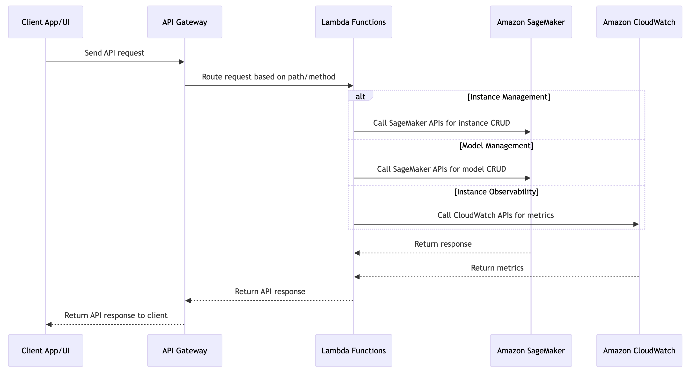
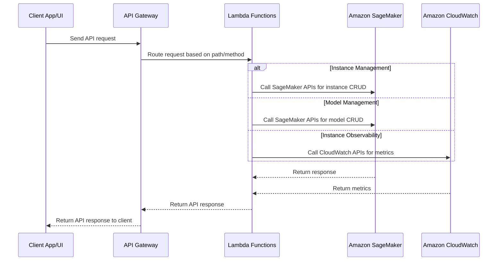

# Model Lifecycle Management (MLM)
model lifecycle management module including instance resource CRUD operations (create, update, delete), model resource management (model create, update, delete, list),  instance resource observability (instance number, instance status, GPU usage, in-flight request number), backed by AWS SageMaker endpoint, with OpenAPI conformed RESTful API expose to client for further UI integration.

## Core Submodules
- Instance Resource Management: Handles CRUD operations for SageMaker endpoint instances. Key functionalities:
    - Create new endpoint instances
    - Update existing endpoint instances (e.g. scale up/down, change instance type)
    - Delete endpoint instances
    - List and describe endpoint instances
- Model Resource Management: Manages the ML models deployed to SageMaker endpoints. Key functionalities:
    - Create new model versions
    - Update existing models (e.g. change model artifacts, containers)
    - Delete model versions
    - List and describe models and their versions
- Instance Observability: Provides visibility into the runtime metrics and status of SageMaker endpoint instances. Key metrics:
    - Number of instances per endpoint
    - Instance status (InService, Updating, Failed, etc.)
    - GPU utilization per instance
    - Number of in-flight inference requests per instance
- RESTful API Layer: Exposes the functionalities of the above submodules through a set of OpenAPI compliant RESTful APIs. The APIs will be used by client applications and UI for integration.

## Overall Workflow
Brief workflow of the MLM module:
- Client applications/UI will send requests to the exposed APIs in API Gateway to perform model lifecycle management operations.
- API Gateway will route the requests to the appropriate Lambda functions based on the API path and HTTP method.
- The Lambda functions will then call the necessary SageMaker APIs to perform the actual operations like creating/updating/deleting endpoint instances and models.
- For observability, the Lambda function will call CloudWatch APIs to fetch the metrics for the endpoint instances.
- The Lambda functions will return the API response to API Gateway which will send it back to the client.

Below are the Mermaid code and the corresponding diagram for the overall workflow of the MLM module:

