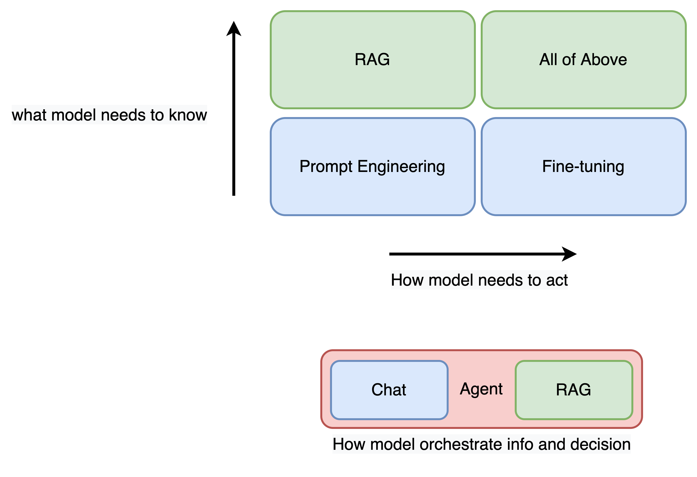
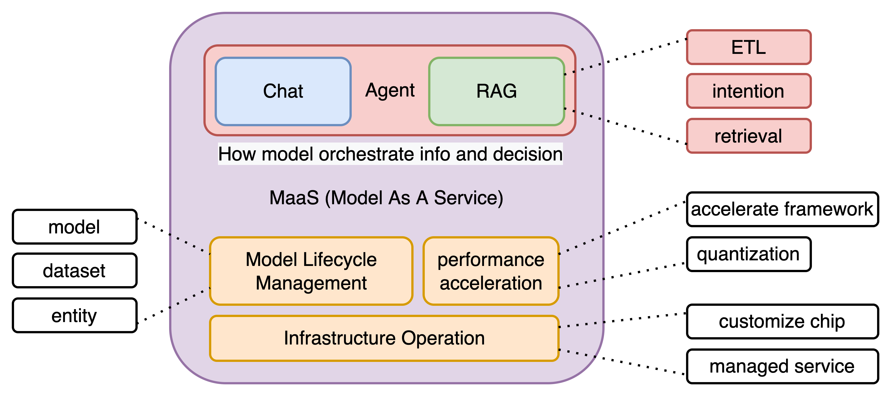
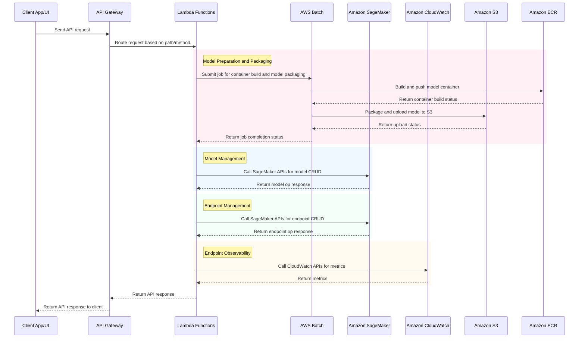
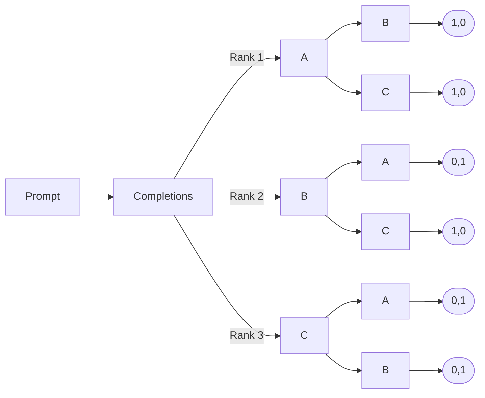

# History

Quadrant division in LLM to performant in downstream tasks:

* Prompt Engineering: This is crucial for guiding the model's behavior through well-crafted prompts, ensuring the responses are aligned with user intent.
* Fine-tuning: Fine-tuning allows the model to specialize in specific tasks or domains, enhancing its effectiveness and accuracy.
* RAG: This involves the model retrieving relevant data from external sources and using it to generate informed responses, ensuring accuracy and relevance.
* All of Above: The model should have a holistic understanding, incorporating diverse techniques to handle various scenarios.

Orchestration of Information and Decision Making:

* Chat: The model engages in dialogues, providing coherent and contextually aware responses.
* Agent: It acts as an autonomous entity, making decisions and performing tasks based on the information it processes.
* RAG: The integration of retrieval mechanisms ensures the model's responses are informed and accurate, combining the strengths of both retrieval and generation.

Model as a Service (MaaS) is an AI method hosted in the cloud that offers developers and businesses the ability to utilize pre-built, pre-trained or customized machine learning models. These models encompass a diverse array of AI functions, such as natural language processing (NLP), computer vision, recommendation systems etc.. MaaS streamlines the incorporation of AI capabilities into applications, without constructing & maintain the whole workflow including data preparation, model training & tuning and infrastructure operation from scratch, allowing businesses to concentrate on addressing practical challenges.

# System Overview
* Model Lifecycle Management, CRUD operation on model, dataset and associate infrastructure (SageMaker Endpoint)
* Model Efficiency, accelerate inference with hardware (customized chip) and software (optimized operator, LMI, model quantization, hosted fine tuning etc.)
    * do we know top 3 techniques are used in consideration for its maturity, performance and eco-system?
    * can we implement the top 3 techniques prototype and commercialization with automation, low code etc.

* Model Evaluation, explainable AI with objective metric and evaluation method (e.g. RAGAS) 
* Tracing, debugging and visualization of the stats from PE, embedding, retrieval
* Filter & particularize content restrictions using AWS Guardrails 
* Full fledge RESTful API and multi-language SDK
* Data Privacy, multi-tenancy with least privilege 

## Model Lifecycle Management

Model lifecycle management module including instance resource CRUD operations (create, update, delete), model resource management (model create, update, delete, list), instance resource observability (instance number, instance status, GPU usage, in-flight request number), backed by AWS SageMaker endpoint, with OpenAPI conformed RESTful API expose to client for further UI integration.

### Core Submodules
- Model Preparation and Packaging: Handles the process of preparing models for deployment using AWS Batch, including:
    - Accepting user-specified model ID and platform (e.g., "THUDM/glm-4-9b-chat" on Hugging Face)
    - Creating and submitting AWS Batch jobs for model container building
    - Packaging models per series
    - Uploading packaged models to specific S3 buckets for SageMaker Endpoint creation
- Instance Resource Management: Handles CRUD operations for SageMaker endpoint instances. Key functionalities:
    - Create new endpoint instances
    - Update existing endpoint instances (e.g. scale up/down, change instance type)
    - Delete endpoint instances
    - List and describe endpoint instances
- Model Resource Management: Manages the ML models deployed to SageMaker endpoints. Key functionalities:
    - Create new model versions
    - Update existing models (e.g. change model artifacts, containers)
    - Delete model versions
    - List and describe models and their versions
- Instance Observability: Provides visibility into the runtime metrics and status of SageMaker endpoint instances. Key metrics:
    - Number of instances per endpoint
    - Instance status (InService, Updating, Failed, etc.)
    - GPU utilization per instance
    - Number of in-flight inference requests per instance
- RESTful API Layer: Exposes the functionalities of the above submodules through a set of OpenAPI compliant RESTful APIs. The APIs will be used by client applications and UI for integration.

### Brief workflow

* Client applications/UI will send requests to the exposed APIs in API Gateway to perform model lifecycle management operations.
* API Gateway will route the requests to the appropriate Lambda functions based on the API path and HTTP method.
    * For model preparation and packaging: The Lambda function will submit a job to AWS Batch. AWS Batch will handle the container building, model packaging, and S3 upload processes. Upon job completion, AWS Batch will notify the Lambda function of the operation status.
    * For model and endpoint management: The Lambda functions will call the necessary SageMaker APIs to perform operations like creating/updating/deleting endpoint instances and models.
    * For observability: The Lambda function will call CloudWatch APIs to fetch metrics for the endpoint instances. The Lambda functions will return the API response to API Gateway, which will send it back to the client.

Consider the technical feasibility, e.g. can we execute docker build command inside AWS Lambda, potential service limitation, e.g. the hard limit 15 minutes of AWS Lambda processing time lead incomplete packaging job if the model size was large, or the base image pulling time longer than expected due to unstable network quality, service availability, e.g. Code Build service is not available in certain AWS regions, cost implication, e.g. the AWS EC2 can be idle since the model packaging job is not frequent thus incur unnecessary cost, we remove the AWS Lambda, EC2 and CodeBuild from the architecture and use AWS Batch to handle the model packaging job.

Below are the Mermaid code and the corresponding diagram for the overall workflow of the MLM module:

The MLM module will expose a set of RESTful APIs conforming to the OpenAPI specification. The OpenAPI specification will define the API paths, methods, request/response schemas, and security requirements. The OpenAPI specification will be used to generate client SDKs and server stubs for easy integration with client applications and UI. Refer to the [OpenAPI Specification](docs/OpenAPI_v1.1.yaml) for the detailed API definitions and Postman compatible [collection](docs/postman_collection_v1.1.json) to import and test the APIs directly.

## Model Efficiency

### acceleration with software

* LMI with SageMaker

* other accelerate framework

## Model Evaluation

LangSmith evaluators newly feature “self-improvement” whereby human corrections to [LLM-as-a-Judge](https://blog.langchain.dev/aligning-llm-as-a-judge-with-human-preferences/) outputs are stored as few-shot examples, which are then fed back into the prompt in future iterations. Inspired by the [paper](https://arxiv.org/pdf/2404.12272), it mentioned an EvalGen Interface which designed to assist users in generating evaluation criteria and implementing assertions for evaluating LLM outputs:
- Provides automated assistance in generating evaluation criteria and implementing assertions.
- Generates candidate implementations (Python functions, LLM grader prompts) and asks humans to grade a subset of LLM outputs.
- Uses human feedback to select implementations that align better with user grades.
The sample code for the EvalGen Interface can be refered to /test/Evalgen.py.
Either the EvalGen Interface or the LangSmith evaluators are just a few examples of how to evaluate LLM outputs, while the dataset prepared and annotated by human-in-the-loop can be further used to train the reward model for RLHF, e.g. use a BERT classifier to predict the probability distribution accross the positive and negative examples for given prompt completion pairs. For example:
The original pairwise of prompt-completion pairs are:

And the transformed dataset for training the reward model is shown below:
| Prompt | Completion y_j (preferred) | Completion y_k (nonpreferred) | Rewards [r_j, r_k] |
|--------|-----------------------------|-------------------------------|--------------------|
| **Chris:** Hey Antje, do you like cats?   **Antje:** I hate cats. I'm allergic to them. | Chris asks Antje if she likes cats.   Antje does not like cats because she is allergic to them. | Chris asks Antje if she likes cats.   Antje hates cats. | [1, 0] |
| **Chris:** Hey Antje, do you like cats?   **Antje:** I hate cats. I'm allergic to them. | Chris asks Antje if she likes cats.   Antje hates cats. | Antje asks Chris if he likes cats.   Chris loves cats because they are fluffy, cute, and cuddly. | [1, 0] |
| **Chris:** Hey Antje, do you like cats?   **Antje:** I hate cats. I'm allergic to them. | Chris asks Antje if she likes cats.   Antje does not like cats because she is allergic to them. | Antje asks Chris if he likes cats.   Chris loves cats because they are fluffy, cute, and cuddly. | [1, 0] |

