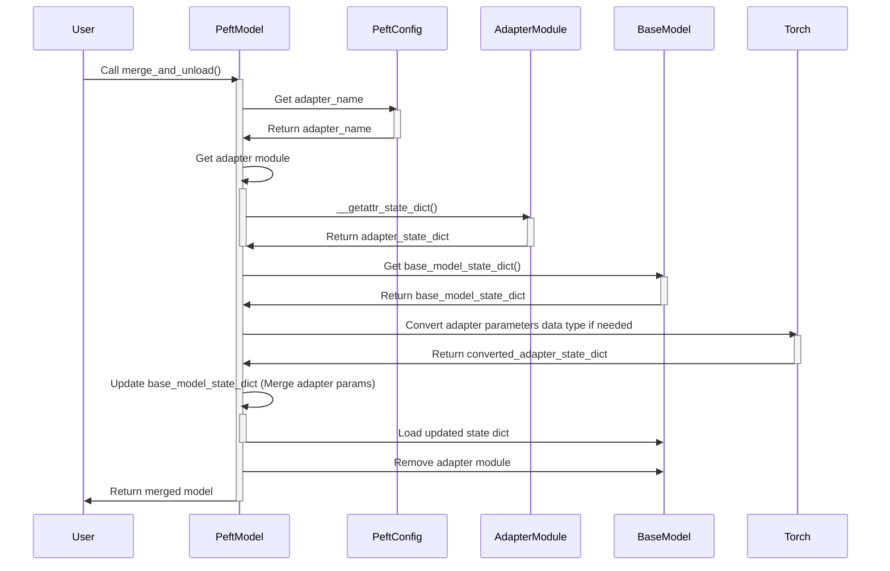

## Q & A (great innovation start from simple questions)

Q: In the context of tokenizer phase, does the input_id is fixed in sequence or mapped according specific corpus rules, or they are just random at the initial phase and depend on specific model implementation
A: Input IDs for tokens in language models are not random, but are assigned in a specific way according to the model's vocabulary and tokenization process. Here are the key points about how input IDs are typically determined:
- Vocabulary creation: During model training, a vocabulary of tokens is created from the training corpus. This vocabulary contains the most common words, subwords, or characters depending on the tokenization method used.
- Assigning IDs: Each unique token in the vocabulary is assigned a unique numerical identifier called a token ID. This mapping of tokens to IDs is fixed once the vocabulary is created.
- Consistency: The mapping between tokens and their IDs remains consistent for a given model/tokenizer. This means the same token will always map to the same ID.
- Corpus-specific: The exact mapping of tokens to IDs can vary between different models and corpora. A token might have different IDs in different models trained on different datasets.
- Special tokens: Most vocabularies include special tokens like [PAD], [UNK], [CLS], [SEP] etc., which are typically assigned specific IDs (often low-numbered IDs).
- Tokenization process: When encoding text, the tokenizer breaks down the input into tokens and looks up the corresponding ID for each token in its vocabulary.
- Out-of-vocabulary handling: Tokens not in the vocabulary are typically mapped to a special [UNK] (unknown) token ID or broken down into smaller subwords/characters that are in the vocabulary.
- Model-specific: The exact tokenization method and vocabulary can vary between different model architectures (e.g., BERT vs. GPT), but the principle of consistent token-to-ID mapping remains.
In summary, input IDs are not random, but are determined by a fixed mapping based on the model's specific vocabulary, which is created during the initial training process. This mapping remains consistent for that particular model/tokenizer implementation.

Q: Does the larger the dimension of vector is, the performant the embedding model is?
A: The dimensionality of embedding vectors does not have a simple linear relationship with model performance. While increasing the dimension of embedding vectors can potentially improve model performance, it's not always true that larger dimensions lead to better performance. Here are some key points to consider:
- Representational capacity: Higher-dimensional embeddings can capture more information and nuances about words or tokens, potentially leading to better performance in certain tasks.
- Overfitting risk: Very high-dimensional embeddings may lead to overfitting, especially if the training data is limited. This can result in poor generalization to unseen data.
- Computational cost: Larger embedding dimensions increase the computational resources required for training and inference, which may not always be justified by the performance gains.
- Task dependency: The optimal embedding dimension can vary depending on the specific task and the complexity of the language or domain being modeled.
- Diminishing returns: There's often a point of diminishing returns, where increasing the embedding dimension beyond a certain point yields minimal or no improvement in performance.
- Model architecture: The overall architecture of the model, not just the embedding dimension, plays a crucial role in determining performance.
In practice, the choice of embedding dimension is often determined empirically through experimentation, considering factors such as model performance, computational resources, and the specific requirements of the task at hand. It's common to see embedding dimensions ranging from a few hundred to several thousand in modern language models, but the optimal size can vary widely depending on the application.

Q: Self-attention implementation in transformer architecture 
A: Detailed step by step with formulae:
**Self-Attention Mechanism**

Self-attention, also known as scaled dot-product attention, is a mechanism that allows a model to weigh the importance of different words in a sentence when processing a specific word. It helps the model understand the context by focusing on relevant words.

**How Self-Attention Works**

1. **Input Representation:**
   - Each word in the input sequence is represented as a vector. For simplicity, let's consider a sentence with three words: "I love movies."

2. **Query, Key, and Value Vectors:**
   - For each word, we create three vectors: Query (Q), Key (K), and Value (V). These vectors are obtained by multiplying the input embeddings with learned weight matrices $$W_Q$$, $$W_K$$, and $$W_V$$.

   $$
   Q = XW_Q, \quad K = XW_K, \quad V = XW_V
   $$

3. **Compatibility Scores:**
   - The compatibility score between the query vector of a word and the key vectors of all words is calculated using the dot product. This score indicates how much focus the model should place on other words when processing the current word.

   $$
   \text{score}(Q_i, K_j) = Q_i \cdot K_j
   $$

4. **Scaled Dot-Product:**
   - To prevent the dot product from growing too large, we scale it by the square root of the dimension of the key vectors ($$d_k$$).

   $$
   \text{scaled\_score}(Q_i, K_j) = \frac{Q_i \cdot K_j}{\sqrt{d_k}}
   $$

5. **Softmax Function:**
   - The scaled scores are passed through a softmax function to obtain the attention weights. These weights determine the importance of each word in the context of the current word.

   $$
   \text{attention\_weights}(Q_i, K) = \text{softmax}\left(\frac{Q_i \cdot K}{\sqrt{d_k}}\right)
   $$

6. **Weighted Sum:**
   - The final output for each word is obtained by taking the weighted sum of the value vectors, using the attention weights.

   $$
   \text{output}_i = \sum_j \text{attention\_weights}(Q_i, K_j) \cdot V_j
   $$

Q: What does multiheaded attention used for in transformer architecture compare to existing self-attention mechanism?
A: Multi-headed attention is a key component of the Transformer architecture that extends the basic self-attention mechanism to capture different aspects of the input sequence simultaneously. Here are some key benefits of multi-headed attention compared to single-headed self-attention:
Diverse Focus: Each attention head can focus on different parts of the sentence, capturing various relationships and dependencies. For example, one head might focus on short-term dependencies while another focuses on long-term dependencies.
Enhanced Representation: By combining the outputs of multiple heads, the model can create a more comprehensive representation of the input sequence.
Improved Performance: Multi-head attention allows the model to learn more complex patterns and relationships, leading to better performance on tasks like translation, summarization, and question answering.
Detailed step by step with formulae:
1. **Multiple Attention Heads:**
   - Instead of having a single set of Q, K, and V vectors, multi-head attention uses multiple sets (heads). Each head operates independently and focuses on different parts of the sentence.

   $$
   \text{head}_i = \text{Attention}(QW_Q^i, KW_K^i, VW_V^i)
   $$

2. **Parallel Processing:**
   - Each attention head processes the input sequence separately, allowing the model to capture various aspects of the sentence simultaneously.

3. **Concatenation and Linear Transformation:**
   - The outputs from all attention heads are concatenated and then linearly transformed to produce the final output.

   $$
   \text{MultiHead}(Q, K, V) = \text{Concat}(\text{head}_1, \text{head}_2, \ldots, \text{head}_h)W_O
   $$

Q: What is Chinchilla scaling laws in the context of AI and how does it help in building and training AI models?
A: Imagine you have a toy car that you want to make go as fast as possible. You have two main things you can change to make it faster: the size of the car's engine and the amount of fuel you give it.

Engine Size: This is like the number of parts inside a computer or a brain that helps it think. In the world of artificial intelligence (AI), we call this the number of parameters. More parameters can help the AI learn and understand more complex things.

Fuel Amount: This is like the data you give to the AI to learn from. The more data you have, the better the AI can learn and make accurate predictions.

Now, the Chinchilla scaling laws are like a guide that tells us the best way to balance the engine size and the fuel amount to make the AI as smart as possible without wasting resources.

Here's the main idea:

If you make the engine (number of parameters) too big without giving it enough fuel (data), the car won't go much faster. It's like having a super powerful engine but only a tiny bit of fuel.
If you have a lot of fuel but only a small engine, you also won't get the best performance. It's like having a huge tank of fuel but a tiny engine that can't use all that fuel efficiently.
The Chinchilla scaling laws suggest that for the best performance, there should be a balance between the engine size and the fuel amount. Specifically, they found that for many AI tasks, it's better to have a smaller engine (fewer parameters) and more fuel (more data). This way, the AI can learn more efficiently and perform better.

So, in simple terms, the Chinchilla scaling laws help scientists and engineers figure out the best way to build and train AI models by balancing the size of the model and the amount of data it learns from. This leads to smarter AI without wasting too much computing power or data.

Q: Why we say stable diffusion is also a transformer based model?
A: - **Transformer Blocks in Vision Models**
- Transformer blocks, originally designed for natural language processing (NLP), have been adapted for use in vision models. These blocks allow models to process visual data by capturing dependencies and relationships between different parts of an image. This adaptation has led to the development of Vision Transformers (ViTs), which apply the transformer architecture to image data.

- Integration into Stable Diffusion Models
Stable Diffusion models generate images by iteratively refining them from noise. Some versions of these models incorporate transformer blocks to enhance their ability to process and generate detailed images. Here's how transformer blocks are used:

    - Attention Mechanisms: Transformer blocks use self-attention mechanisms to weigh the importance of different parts of the image. This helps the model focus on relevant features during each refinement step.

    - Cross-Attention Layers: When generating images based on text descriptions (text-to-image generation), cross-attention layers align text features with image features. This ensures that the generated image accurately reflects the text description.

    - Hierarchical Processing: Transformer blocks allow the model to process images hierarchically, refining details at multiple levels. This is similar to how transformers process text in stages, capturing both local and global patterns.

- References and Sources
Original Vision Transformer Paper:

    - Dosovitskiy, A., et al. (2020). "An Image is Worth 16x16 Words: Transformers for Image Recognition at Scale". arXiv
This paper introduces the Vision Transformer (ViT) and discusses how transformer blocks can be applied to image data.

Diffusion Models and Transformers:

    - Nichol, A., Dhariwal, P. (2021). "Improved Denoising Diffusion Probabilistic Models". arXiv
        This paper discusses improvements to diffusion models and mentions the use of attention mechanisms, which are a core component of transformers.

Text-to-Image Generation with Transformers:

    - Ramesh, A., et al. (2021). "Zero-Shot Text-to-Image Generation". arXiv
    This paper introduces DALL-E, a model that uses transformer blocks for text-to-image generation, demonstrating how cross-attention layers align text and image features.

Stable Diffusion and Transformers:

    - Researchers and developers often discuss the integration of transformer components in forums and technical blogs. For example, the use of transformers in models like DALL-E and CLIP (Contrastive Language–Image Pretraining) provides insights into how similar techniques can be applied to Stable Diffusion models.

- Summary
In summary, transformer blocks enhance Stable Diffusion models by providing advanced attention mechanisms and hierarchical processing capabilities. These blocks allow the model to focus on relevant features, align text and image data, and refine images through multiple stages. The integration of transformer-based components in vision models, as discussed in key research papers, supports the use of these techniques in Stable Diffusion models.

Q: Core implementation and mathmatical theory behind LoRA?
A: Rank decomposition refers to a mathematical technique where a matrix is approximated by the product of two smaller matrices. This is often done to reduce the complexity of the matrix operations and to capture essential features with fewer parameters.

Mathematically:
If you have a matrix W (which could represent the weights of a layer in a neural network), you can decompose it into two smaller matrices 
A and B such that:
𝑊 ≈ 𝐴⋅𝐵
Here, A and B are the rank decomposition matrices. The rank of this decomposition is determined by the dimensions of A and B.

How LoRA Uses Rank Decomposition
In LoRA, the goal is to adapt a pre-trained model to a new task without updating all of its parameters. Here's how it works:

Freeze Original Parameters: All the original parameters of the model are frozen. This means they are not updated during the fine-tuning process.

Insert Low-Rank Matrices: For a targeted set of modules in the model (typically linear layers, including self-attention layers), a pair of low-rank matrices A and B are inserted alongside the original weights.

Parameter Update: During fine-tuning, only the low-rank matrices A and B are updated. The original weights remain unchanged.

Example:
Suppose 
W is a weight matrix in a linear layer. Instead of updating W directly, LoRA introduces two matrices A and 
B such that:
𝑊′ = 𝑊 + 𝐴⋅𝐵. Here: W is the original weight matrix (frozen during fine-tuning). A and B are the low-rank matrices that are learned during fine-tuning. This way, the effective weight matrix W′ used during the forward pass is a combination of the original weights and the product of the low-rank matrices. Since A and B are much smaller than W, the number of parameters to be trained is significantly reduced.

Q: Detailed implementation of the Merging LoRA Adapter with Original Model using PEFT model (merge_and_unload)
A: Let's dive deep into the implementation of merge_and_unload process in PEFT model

**Modules and Libraries Involved**

- PeftModel: The main class responsible for managing PEFT models and calling merge_and_unload.
- PeftConfig: Stores the configuration for the PEFT model, including the adapter name.
- AdapterModule: The specific adapter module (e.g., lora, prefix_tuning) that holds the adapter parameters.
- BaseModel: The original pre-trained model to be merged with the adapter.
- Torch: The PyTorch library, used for tensor operations like data type conversion and state dict loading.

**Key Points**

The merge_and_unload process is triggered by a user calling the function on a PeftModel instance.
It involves retrieving the adapter state dict, base model state dict, and performing the merge.
PyTorch is used to handle the merging of parameters and updating the base model's state.
Finally, the merged model is returned to the user.

Q: Introduce the self attention and MLP in transformer architecture of LLM and how those two components cooperate
A: 
**Self-Attention Mechanism**
The self-attention mechanism is a core component of the Transformer architecture. It allows the model to weigh and prioritize different parts of the input sequence when generating an output. The self-attention operation relates various tokens in a single sequence to derive a sequence representation.
For each token in the input sequence, the self-attention mechanism computes three vectors: query (Q), key (K), and value (V). The attention score between any two tokens is calculated by taking the dot product of the query vector of one token and the key vector of the other token. These scores are then normalized using a softmax function to obtain attention weights. Finally, the value vectors are weighted by the attention weights and summed to produce the output for each token.
The self-attention mechanism enables the model to capture dependencies between tokens regardless of their distance in the sequence. This allows the Transformer to handle long-range dependencies more effectively than recurrent neural networks (RNNs).
**Multi-Layer Perceptron (MLP)**
In the Transformer architecture, each layer consists of a self-attention mechanism followed by a position-wise feed-forward network, also known as an MLP layer. The MLP layer applies a non-linear transformation to each token independently, allowing the model to capture complex patterns and interactions within the sequence.
The MLP typically consists of two linear transformations with a ReLU activation in between. It takes the output of the self-attention layer as input and produces a new representation for each token. with an activation function (usually ReLU) in between. The first linear layer projects the input to a higher-dimensional space, and the second linear layer projects it back to the original embedding dimension. FFN(𝑥) = Linear2(ReLU(Linear1(𝑥)))
**Cooperation between Self-Attention and MLP**
The self-attention mechanism and MLP layers work together to enable the Transformer to model complex dependencies and generate coherent output sequences. Here's how they cooperate:
- The self-attention layer captures the relationships and dependencies between tokens in the input sequence. It allows each token to attend to other relevant tokens and gather contextual information.
- The output of the self-attention layer is then passed through the MLP layer, which applies a non-linear transformation to each token independently. This allows the model to further process and refine the representations learned by the self-attention mechanism.
- The residual connections and layer normalization used in the Transformer architecture facilitate the flow of information and gradients through the network, enabling effective training of deep models. 
- Multiple Transformer layers are stacked on top of each other, allowing the model to capture hierarchical representations and learn increasingly complex patterns.

Q: Any disadvantage or limitation in MoE model compare to normal LLM?
A: The Mixture of Experts (MoE) model offers several advantages, such as improved performance on complex tasks and the ability to handle diverse inputs. However, there are also some disadvantages and limitations associated with MoE models compared to traditional Large Language Models (LLMs). Here are some key drawbacks of MoE models:
- **Complexity and Training Time:** MoE models are more complex than traditional LLMs due to the presence of multiple expert networks and the gating mechanism. Training MoE models can be computationally intensive and time-consuming, requiring significant resources.
- **Resource Requirements:** MoE models require more memory and computational resources compared to traditional LLMs. The need to store and process multiple expert networks and the gating mechanism can lead to higher resource usage (high VRAM) during training and inference.
- **Inference Overhead:** During inference, MoE models may require additional computation to select the appropriate expert for a given input. This can result in increased latency and computational overhead compared to LLMs.
- **Interpretability:** MoE models may be less interpretable compared to traditional LLMs. The interactions between the expert networks and the gating mechanism can make it harder to understand how the model makes predictions and what features contribute to its decisions.
- **Overfitting:** MoE models can be more prone to overfitting, some experts might be used more frequently than others, leading to imbalanced load and potentially underutilized resources. This can also result in overfitting for frequently used experts and underfitting for less used ones.

