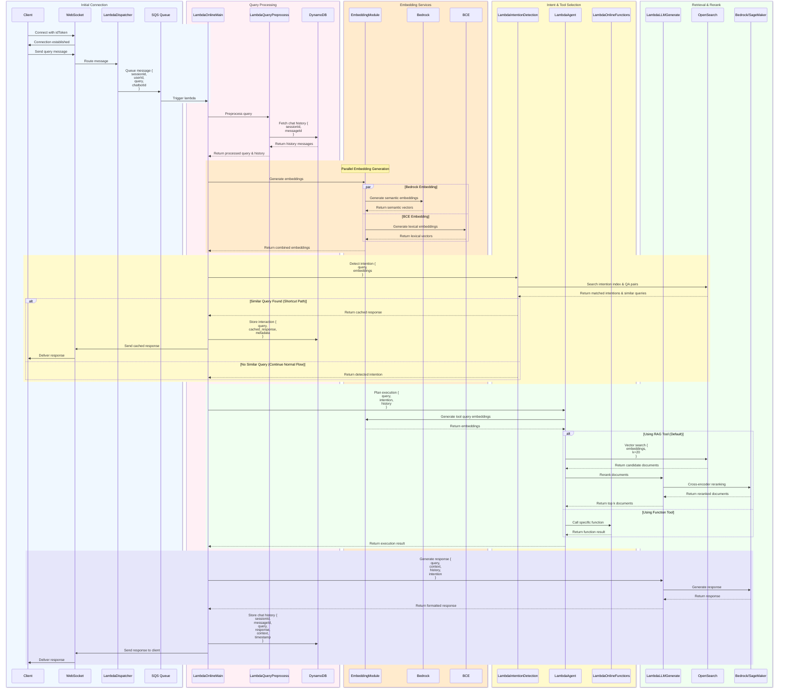

## Actual workflow implementation

Key components:

1. Initial Connection:
- Client connects via WebSocket with authentication token (idToken)
- WebSocket establishes connection and handles message routing
- LambdaDispatcher routes messages to SQS queue
- SQS queue triggers LambdaOnlineMain for processing

2. Query Processing:
- LambdaOnlineMain orchestrates the overall processing flow
- LambdaQueryPreprocess handles initial query preprocessing
- DynamoDB stores and retrieves chat history based on sessionId and messageId
- Returns processed query and relevant chat history

3. Embedding Services:
- EmbeddingModule handles parallel embedding generation
- Bedrock generates semantic embeddings
- BCE (Binary Code Embedding) generates lexical embeddings
- Combines both embeddings for enhanced search capabilities

4. Intent & Tool Selection:
- LambdaIntentionDetection analyzes query intent using embeddings
- OpenSearch searches intention index and QA pairs
- Provides shortcut path for similar existing queries
- LambdaAgent handles tool selection and execution planning
- LambdaOnlineFunctions provides specific function implementations

5. Retrieval & Rerank:
- OpenSearch performs vector search on document embeddings
- Returns candidate documents (default k=20)
- LambdaLLMGenerate performs cross-encoder reranking using Bedrock/SageMaker
- Selects top k most relevant documents as context
- Generates natural language response combining query, context, and history

6. Response Generation & Storage:
- LambdaLLMGenerate combines all information to generate final response
- Uses Bedrock/SageMaker for response generation
- DynamoDB stores complete interaction history
- Response sent back to client via WebSocket connection

The workflow supports two main paths:
1. Shortcut Path: When similar queries are found, returns cached responses
2. Full Processing Path: Performs complete RAG (Retrieval-Augmented Generation) or function-based processing

All interactions are logged in DynamoDB with:
- sessionId and messageId for tracking
- Complete query and response pairs
- Retrieved context and metadata
- Timestamps for auditing

Workflow diagram:
