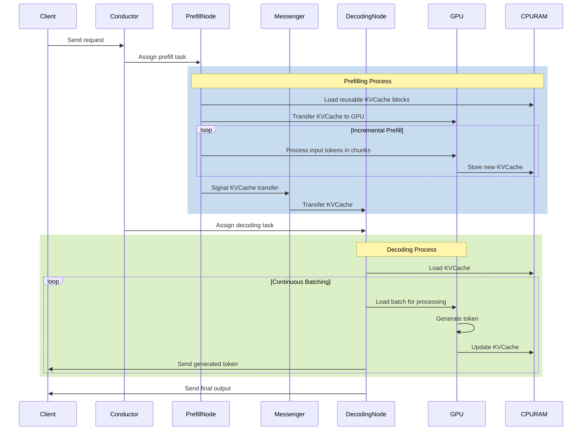

# Acceleration Frameworks
## LLAMA.CPP
```
git clone https://github.com/ggerganov/llama.cpp && cd llama.cpp && make -j4 && cd models/ && wget https://huggingface.co/TheBloke/vicuna-7B-v1.5-GGUF/resolve/main/vicuna-7b-v1.5.Q5_0.gguf && cd .. && ./main -m models/vicuna-7b-v1.5.Q5_0.gguf && ./server -m models/vicuna-7b-v1.5.Q5_0.gguf
```

Login to http://127.0.0.1:8080/ and start your conversation with LLM running locally.

### vLLM

### TGI

### TensorRTLLM

### exllamav2

# Acceleration Techniques
## Prefill and Decoding Process
### Prefill Process
1. Input Token Processing:

The prefill stage begins with processing all input tokens in parallel. This stage is computationally intensive and involves generating the first output token while storing intermediate results of computed keys and values, known as the KVCache.

2. KVCache Reuse:

The selected prefill node receives a request that includes the raw input, the block IDs of the prefix cache that can be reused, and the block IDs of the full cache allocated to the request. It loads the prefix cache from remote CPU memory into GPU memory based on the prefix cache block IDs to bootstrap the request. This step is skipped if no prefix cache exists.

3. Incremental Prefill:

The prefill node completes the prefill stage using the prefix cache and stores the newly generated incremental KVCache back into CPU memory. If the number of uncached input tokens exceeds a certain threshold (prefill_chunk), the prefill stage is split into multiple chunks and executed in a pipeline manner. This threshold is selected to fully utilize the corresponding GPU's computational power and is typically larger than 1000 tokens.

4. Layer-wise Prefill:

KVCache loading and storing are executed asynchronously via launch and wait operations. Before each layer's attention computation begins, the model waits for the asynchronous loading of that layer's KVCache to complete and triggers the next layer's asynchronous KVCache loading. After the attention calculation is complete, asynchronous storage of that layer's KVCache is launched.

5. KVCache Transfer:

The Messenger service is deployed in each node to manage and transfer these caches. Each Messenger operates as an independent process within its respective inference instance, receiving signals to facilitate high-speed, cross-machine KVCache transfer. This step is asynchronously executed and overlapped with the above incremental prefill step, streaming the KVCache generated by each model layer to the destination decoding node's CPU memory to reduce waiting time.

### Decoding Process
1. KVCache Loading:

After all the KVCache is received in the CPU DRAM of the decoding node, the request joins the next batch in a continuous batching manner. Conductor pre-selects the decoding node based on its current load to ensure it does not violate the Time Between Tokens (TBT) SLO.

2. Continuous Batching:

Before each iteration, the scheduler checks the status of all requests, adding newly arrived requests to the batch's prefill stage while removing completed requests. This continuous batching process helps in maximizing the Model FLOPs Utilization (MFU) by aggregating as many tokens as possible in a decoding batch.

3. Autoregressive Token Generation:

The decoding stage processes only one token at a time per batch due to the limitation of autoregressive generation. This stage uses the KVCache to autoregressively generate new tokens, adding new keys and values from the computation to the KVCache.

4. Asynchronous Loading:

For decoding instances, asynchronous loading of KVCache is performed concurrently with GPU decoding to prevent GPU idle time. This ensures that the decoding process is efficient and minimizes latency.

5. Final Output Generation:

 The decoding stage continues until the entire sequence of output tokens is generated. The process is constrained by the TBT SLO, ensuring that the latency between successive token generations for the same request is minimized.

Summary
1. KVCache Reuse: Load reusable KVCache blocks into GPU memory for the prefill stage.

2. Incremental Prefill: Process input tokens in chunks, store new KVCache in CPU memory.

3. KVCache Transfer: Use Messenger service for high-speed KVCache transfer to decoding nodes.

4. KVCache Loading: Load KVCache into decoding nodes' CPU DRAM, join requests in continuous batching.

5. Autoregressive Generation: Generate tokens one-by-one using KVCache, update KVCache with new keys and values.

6. Asynchronous Operations: Overlap KVCache loading and storing with computation to reduce latency and improve efficiency.

### Workflow Diagram



## LLM Quantanization
### Usage of Skip RmsNorm A & Quantize

The "Skip RmsNorm A & Quantize" block in the workflow serves two primary purposes: normalization and quantization. Here's a detailed explanation of each component:

#### 1. **RMS Normalization (RmsNorm)**
RMSNorm (Root Mean Square Layer Normalization) is a normalization technique used to stabilize and improve the training of neural networks, particularly transformers. It normalizes the input data by dividing it by its root mean square (RMS) value. This process helps in maintaining the scale of the activations, which can lead to faster convergence and better performance.

**Advantages of RMSNorm over LayerNorm:**
- **Efficiency**: RMSNorm is computationally more efficient than LayerNorm because it does not require mean centering, which reduces the computational overhead.
- **Memory Bandwidth**: It saves memory bandwidth, which can be crucial for large models and resource-constrained environments.

#### 2. **Quantization**
Quantization is the process of converting the floating-point representations of weights and activations into lower precision formats, such as 8-bit integers (INT8). This process significantly reduces the model size and computational requirements, making it more efficient in terms of memory and speed.

**Benefits of Quantization:**
- **Reduced Memory Usage**: By converting FP16 or FP32 values to INT8, the memory footprint of the model is reduced, which is beneficial for deploying models on devices with limited memory.
- **Increased Speed**: Integer operations are generally faster than floating-point operations, leading to reduced inference time.
- **Power Efficiency**: Lower precision computations consume less power, which is advantageous for edge devices and mobile applications.

### Integration in the Workflow
In the provided workflow, the "Skip RmsNorm A & Quantize" block is applied to the input data in FP16 format. This block performs the following operations:
1. **Skip Connection**: It creates a skip connection that bypasses the normalization and quantization steps, preserving the original input data.
2. **RMS Normalization**: The input data is normalized using RMSNorm.
3. **Quantization**: The normalized data is quantized to INT8 format.

### Sample Code Implementation

Below is a sample code snippet that demonstrates the implementation of the "Skip RmsNorm A & Quantize" block:

```python
import torch
import torch.nn as nn
import torch.quantization

class SkipRmsNormQuantize(nn.Module):
    def __init__(self, hidden_dim):
        super(SkipRmsNormQuantize, self).__init__()
        self.norm = nn.LayerNorm(hidden_dim)
        self.quant = torch.quantization.QuantStub()

    def forward(self, x):
        x_skip = x  # Skip connection
        x = self.norm(x)  # RMS Normalization
        x = self.quant(x)  # Quantization to INT8
        return x + x_skip  # Adding skip connection

# Example usage
input_data = torch.randn(1, 1024, dtype=torch.float16)
model = SkipRmsNormQuantize(hidden_dim=1024)
model.qconfig = torch.quantization.get_default_qconfig('fbgemm')
torch.quantization.prepare(model, inplace=True)
output = model(input_data)
torch.quantization.convert(model, inplace=True)
```

### Conclusion
The "Skip RmsNorm A & Quantize" block in the transformer workflow is crucial for enhancing the model's efficiency by normalizing the input data and reducing its precision. This combination helps in achieving faster computations, reduced memory usage, and better power efficiency, making it suitable for deployment in resource-constrained environments.