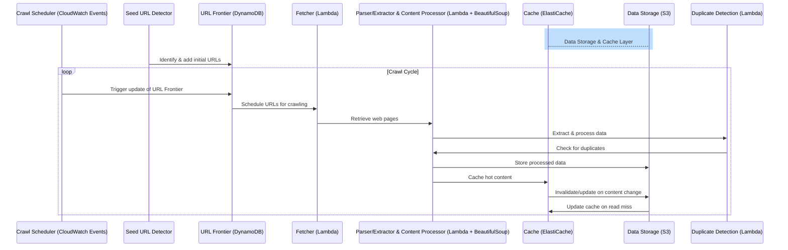

# Background
Designing a distributed web crawler system, especially one powered by a Large Language Model (LLM) capable of crawling billions of web pages, involves a comprehensive understanding of the core components, interactive workflow, performance optimization strategies, and the selection of appropriate frameworks and languages. This endeavor aims to create a system that is scalable, efficient, and capable of handling the vastness and dynamism of the web.

## Core Components
The core components of a distributed web crawler system include the following:
- Seed URL Detector: Initiates the crawl by selecting starting URLs based on specific criteria or inputs.

- URL Frontier: Manages the queue of URLs to be visited, prioritizing them based on certain algorithms to optimize the crawl. Amazon DynamoDB can be used to manage the queue of URLs efficiently, provides the scalability needed to handle the URL Frontier's demands, including prioritizing URLs based on certain algorithms.

- Fetcher: Downloads web pages from the URLs provided by the URL Frontier. Amazon Lambda functions, written in Python, can be utilized to fetch web pages. Lambda allows for running code in response to triggers (such as new URLs added to the URL Frontier in DynamoDB) without managing servers, which aligns with the need for parallel processing.

- **Parser/Extractor & Content Processor:**: Extracts links, data, and other relevant information from the fetched web pages, processes the extracted data, which may involve running it through a Large Language Model for analysis, extraction of insights, or preparation for storage. Amazon Lambda functions can be used to process the extracted data, potentially utilizing AWS BedRock API to interact with a Large Language Model for advanced analysis. And we consider to use BeautifulSoup for lite scraping jobs.

- Data Storage & Cache: Stores the crawled data in a structured format for easy retrieval and analysis. This can include databases or file storage systems. Amazon S3 for raw and processed data storage. S3 offers high durability, availability, and scalability, making it suitable for storing the vast amounts of data a web crawler would collect. For structured data resulting from the content processing phase, Amazon DynamoDB can be used depending on the data's nature and query requirements. Frequently accessed and unchanged data is cached using Amazon ElastiCache, either Redis or Memcached, based on the application's requirements. This caching layer serves as an intermediary storage to quickly serve repeated requests without hitting the primary data storage, thus reducing latency and improving response times for the upstream web search engine.

- Crawl Scheduler: Manages the timing and frequency of crawls to ensure up-to-date information and efficient use of resources. Amazon CloudWatch Events can be used to trigger Lambda functions that update the URL Frontier based on predefined schedules or conditions.

- Duplicate Detection: Identifies and avoids re-crawling or storing duplicate content, which is crucial for efficiency and storage optimization. Amazon Lambda functions, using hashing algorithms to detect duplicate content before storing it in S3 or DynamoDB.

## Interactive Workflow
The workflow of a distributed web crawler involves several steps that are cyclically repeated:
- The Seed URL Detector identifies initial URLs to start the crawling process.
- These URLs are added to the URL Frontier, which schedules them for crawling based on priority.
- The Fetcher retrieves the content of the web pages at the scheduled URLs.
- The Parser/Extractor analyzes the fetched content, extracting links, data, and other relevant information.
- Extracted data is processed by the Content Processor, potentially utilizing a Large Language Model for advanced analysis or insight extraction.
- Processed data is stored in the Data Storage component for future retrieval and analysis.
- The Crawl Scheduler plans subsequent crawls, adding new URLs to the URL Frontier and adjusting the crawl frequency as needed.
- Duplicate Detection mechanisms ensure that duplicate content is not re-crawled or stored, optimizing the crawl process.

The mermaid diagram below illustrates the interactive workflow of a distributed web crawler system:

## Performance Optimization
To optimize the performance of a distributed web crawler system, several strategies can be employed:
- Parallel Processing: Utilize distributed computing resources to crawl and process multiple URLs in parallel, e.g. using concurrent execution in Lambda functions.

- Caching: Implement caching layeer to accelerate the retrieval of frequently & unchanged accessed data for the upstream web search engine. Caching can be implemented at various levels, including in-memory caching or using Amazon ElastiCache for distributed caching.

- Politeness Policies: (1) Adhere to robots.txt and implement rate limiting to avoid overloading web servers, (2) Implementing politeness policies and bandwidth detection to avoid overloading web servers. Implementing these within Lambda functions ensures that the crawler respects site-specific rules and avoids overloading servers, potentially using DynamoDB to store and manage politeness configurations for different domains.

- Priority Crawling: Prioritizing which sites to crawl based on certain criteria to optimize the crawl process. DynamoDB's flexible querying and sorting capabilities allow for implementing priority-based crawling efficiently.

- Update and Duplicate Detection: Making HEAD requests to check for page updates and implementing algorithms to detect duplicate content.

- Efficient Storage: Optimize data storage for quick retrieval and minimal space usage, e.g. using compression or indexing.

- Monitoring and Logging: Implement comprehensive monitoring and logging to track the performance of the crawler, detect issues, and optimize resource usage. Use Amazon CloudWatch for monitoring and logging Lambda function invocations, errors, and performance metrics with dashboards and alarms for real-time insights.