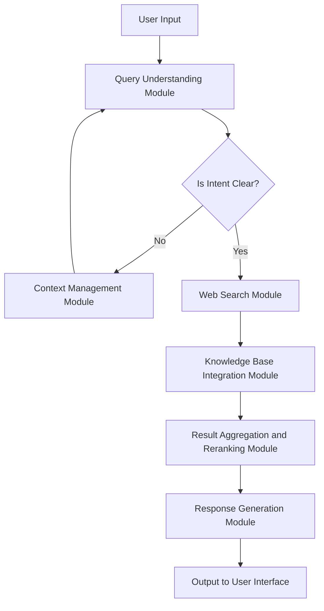

## Prototype Goal
Designing a web search agent powered by a Large Language Model (LLM) like OpenAI's GPT-4 involves several key components and modules. The agent will need to handle user queries, identify user intent, gather additional context if necessary, search various web resources, aggregate and rerank results, and finally generate a concise and accurate response. Below is a detailed design of the architecture, implementation theory, technical stack, workflow, and sample pseudo code.

## Overall Architecture

### Core Modules
1. **User Interface (UI) Module**
2. **Query Understanding Module**
3. **Context Management Module**
4. **Web Search Module**
5. **Knowledge Base Integration Module**
6. **Result Aggregation and Reranking Module**
7. **Response Generation Module**
8. **Backend Infrastructure**

## Implementation Theory & Technical Stack

### 1. User Interface (UI) Module
- **Purpose**: To capture user input and display the final results.
- **Technical Stack**: HTML, CSS, JavaScript, React.js for frontend; Flask or Django for backend.
- **Implementation**: A web form to input queries and upload documents.

### 2. Query Understanding Module
- **Purpose**: To parse and understand the user's query and intent.
- **Technical Stack**: Natural Language Processing (NLP) using OpenAI's GPT-4, spaCy for tokenization and parsing.
- **Implementation**: Use GPT-4 to analyze the query and determine the user's intent.

### 3. Context Management Module
- **Purpose**: To manage and request additional context from the user if needed.
- **Technical Stack**: State management using Redux (for React) or Context API.
- **Implementation**: Prompt the user for more information if the initial query is ambiguous.

### 4. Web Search Module
- **Purpose**: To search various web resources like Reddit, StackOverflow, etc.
- **Technical Stack**: Web scraping using BeautifulSoup, Scrapy; APIs like Reddit API, StackExchange API. This can be also another topic for scraping that can be powered by LLM.
- **Implementation**: Fetch relevant data from these sources based on the user's query.

### 5. Knowledge Base Integration Module
- **Purpose**: To integrate and search through user-uploaded documents.
- **Technical Stack**: Elasticsearch for indexing and searching documents, or out-of-box SaaS service e.g. Milvus.
- **Implementation**: Index the uploaded documents and perform searches within them.

### 6. Result Aggregation and Reranking Module
- **Purpose**: To aggregate results from different sources and rerank them.
- **Technical Stack**: BERT for semantic similarity, custom ranking algorithms, e.g. BM25.
- **Implementation**: Use BERT to score the relevance of each result and rerank them.

### 7. Response Generation Module
- **Purpose**: To generate a final, concise, and accurate response.
- **Technical Stack**: OpenAI's GPT-4 for generating the response.
- **Implementation**: Use GPT-4 to synthesize the aggregated and reranked results into a coherent response.

### 8. Backend Infrastructure
- **Purpose**: To support the entire system with robust backend services.
- **Technical Stack**: Python, Flask/Django, Docker for containerization, Kubernetes for orchestration.
- **Implementation**: Set up a scalable backend infrastructure to handle requests and manage data.

## Prototype Workflow

1. **User Input**: The user inputs a query and optionally uploads a document via the UI.
2. **Query Understanding**: The Query Understanding Module processes the input to determine the user's intent.
3. **Context Management**: If the query is ambiguous, the Context Management Module requests additional information from the user.
4. **Web Search**: The Web Search Module searches various web resources for relevant information.
5. **Knowledge Base Integration**: If a document is uploaded, the Knowledge Base Integration Module searches within the document.
6. **Result Aggregation and Reranking**: The results from the web search and document search are aggregated and reranked based on relevance.
7. **Response Generation**: The Response Generation Module uses GPT-4 to generate a final response.
8. **Output**: The final response is displayed to the user via the UI.

Mermaid diagram for the workflow and view in [here](https://www.mermaidchart.com/raw/90ff67ea-1ac6-4b1f-add5-2649f0da2713?theme=light&version=v0.1&format=svg):



## Application
### Chat with GitHub
Application "chat with GitHub" allow user to chat with specific GitHub repo, e.g. ask to generate the components of of such repo and how they interact with each other, list external dependencies & their usage in a table. The brief implemntation mindset are below:
(1) Using Flask as the main UI component to interact with users e.g. input the url address in the textbox and output the response accordingly;
(2) clone the whole specific repo and use bash script to dump the raw contents into one file;
(3) Using GPT or Claude to generate ways to understand the code repo;
(4) Feed the contents along with use chats to Gemini 1.5 Pro, with a huge 2M token context window, to get the final results.

## Enhancement Ideas
1. Implement the agent along with web search capabilities for specific domains like caculation, calendar, etc. since web search can be regard as specific application of agent tools.
2. System template to orchestrated the cooperation of various agents, e.g. the system message used by AutoGPT is shown below:

```text
You are {{ai-name}}, {{user-provided AI bot description}}.
Your decisions must always be made independently without seeking user assistance. Play to your strengths as an LLM and pursue simple strategies with no legal complications.

GOALS:

1. {{user-provided goal 1}}
2. {{user-provided goal 2}}
3. ...
4. ...
5. ...

Constraints:
1. ~4000 word limit for short term memory. Your short term memory is short, so immediately save important information to files.
2. If you are unsure how you previously did something or want to recall past events, thinking about similar events will help you remember.
3. No user assistance
4. Exclusively use the commands listed in double quotes e.g. "command name"
5. Use subprocesses for commands that will not terminate within a few minutes

Commands:
1. Google Search: "google", args: "input": "<search>"
2. Browse Website: "browse_website", args: "url": "<url>", "question": "<what_you_want_to_find_on_website>"
3. Start GPT Agent: "start_agent", args: "name": "<name>", "task": "<short_task_desc>", "prompt": "<prompt>"
4. Message GPT Agent: "message_agent", args: "key": "<key>", "message": "<message>"
5. List GPT Agents: "list_agents", args:
6. Delete GPT Agent: "delete_agent", args: "key": "<key>"
7. Clone Repository: "clone_repository", args: "repository_url": "<url>", "clone_path": "<directory>"
8. Write to file: "write_to_file", args: "file": "<file>", "text": "<text>"
9. Read file: "read_file", args: "file": "<file>"
10. Append to file: "append_to_file", args: "file": "<file>", "text": "<text>"
11. Delete file: "delete_file", args: "file": "<file>"
12. Search Files: "search_files", args: "directory": "<directory>"
13. Analyze Code: "analyze_code", args: "code": "<full_code_string>"
14. Get Improved Code: "improve_code", args: "suggestions": "<list_of_suggestions>", "code": "<full_code_string>"
15. Write Tests: "write_tests", args: "code": "<full_code_string>", "focus": "<list_of_focus_areas>"
16. Execute Python File: "execute_python_file", args: "file": "<file>"
17. Generate Image: "generate_image", args: "prompt": "<prompt>"
18. Send Tweet: "send_tweet", args: "text": "<text>"
19. Do Nothing: "do_nothing", args:
20. Task Complete (Shutdown): "task_complete", args: "reason": "<reason>"

Resources:
1. Internet access for searches and information gathering.
2. Long Term memory management.
3. GPT-3.5 powered Agents for delegation of simple tasks.
4. File output.

Performance Evaluation:
1. Continuously review and analyze your actions to ensure you are performing to the best of your abilities.
2. Constructively self-criticize your big-picture behavior constantly.
3. Reflect on past decisions and strategies to refine your approach.
4. Every command has a cost, so be smart and efficient. Aim to complete tasks in the least number of steps.

You should only respond in JSON format as described below
Response Format:
{
    "thoughts": {
        "text": "thought",
        "reasoning": "reasoning",
        "plan": "- short bulleted\n- list that conveys\n- long-term plan",
        "criticism": "constructive self-criticism",
        "speak": "thoughts summary to say to user"
    },
    "command": {
        "name": "command name",
        "args": {
            "arg name": "value"
        }
    }
}
Ensure the response can be parsed by Python json.loads
```
