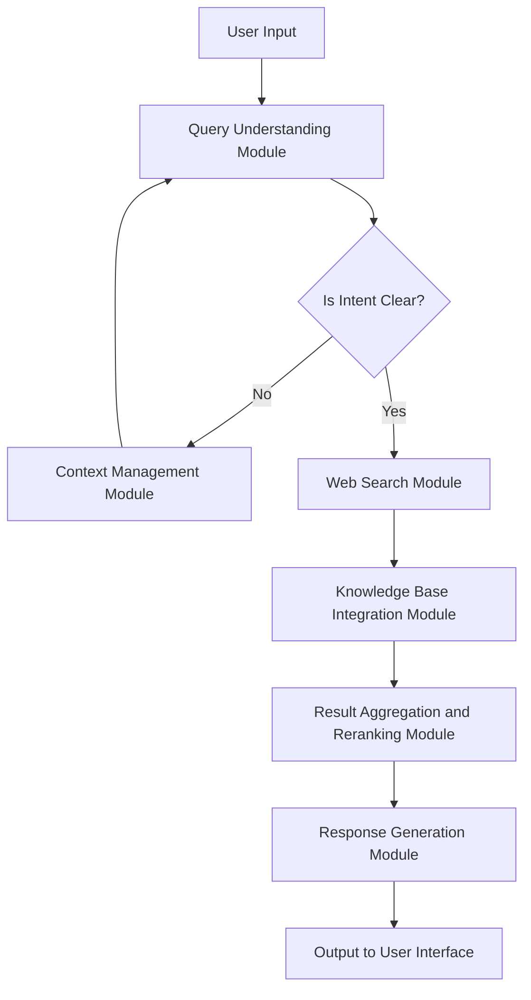

## Prototype Goal
Designing a web search agent powered by a Large Language Model (LLM) like OpenAI's GPT-4 involves several key components and modules. The agent will need to handle user queries, identify user intent, gather additional context if necessary, search various web resources, aggregate and rerank results, and finally generate a concise and accurate response. Below is a detailed design of the architecture, implementation theory, technical stack, workflow, and sample pseudo code.

## Overall Architecture

### Core Modules
1. **User Interface (UI) Module**
2. **Query Understanding Module**
3. **Context Management Module**
4. **Web Search Module**
5. **Knowledge Base Integration Module**
6. **Result Aggregation and Reranking Module**
7. **Response Generation Module**
8. **Backend Infrastructure**

## Implementation Theory & Technical Stack

### 1. User Interface (UI) Module
- **Purpose**: To capture user input and display the final results.
- **Technical Stack**: HTML, CSS, JavaScript, React.js for frontend; Flask or Django for backend.
- **Implementation**: A web form to input queries and upload documents.

### 2. Query Understanding Module
- **Purpose**: To parse and understand the user's query and intent.
- **Technical Stack**: Natural Language Processing (NLP) using OpenAI's GPT-4, spaCy for tokenization and parsing.
- **Implementation**: Use GPT-4 to analyze the query and determine the user's intent.

### 3. Context Management Module
- **Purpose**: To manage and request additional context from the user if needed.
- **Technical Stack**: State management using Redux (for React) or Context API.
- **Implementation**: Prompt the user for more information if the initial query is ambiguous.

### 4. Web Search Module
- **Purpose**: To search various web resources like Reddit, StackOverflow, etc.
- **Technical Stack**: Web scraping using BeautifulSoup, Scrapy; APIs like Reddit API, StackExchange API. This can be also another topic for scraping that can be powered by LLM.
- **Implementation**: Fetch relevant data from these sources based on the user's query.

### 5. Knowledge Base Integration Module
- **Purpose**: To integrate and search through user-uploaded documents.
- **Technical Stack**: Elasticsearch for indexing and searching documents, or out-of-box SaaS service e.g. Milvus.
- **Implementation**: Index the uploaded documents and perform searches within them.

### 6. Result Aggregation and Reranking Module
- **Purpose**: To aggregate results from different sources and rerank them.
- **Technical Stack**: BERT for semantic similarity, custom ranking algorithms, e.g. BM25.
- **Implementation**: Use BERT to score the relevance of each result and rerank them.

### 7. Response Generation Module
- **Purpose**: To generate a final, concise, and accurate response.
- **Technical Stack**: OpenAI's GPT-4 for generating the response.
- **Implementation**: Use GPT-4 to synthesize the aggregated and reranked results into a coherent response.

### 8. Backend Infrastructure
- **Purpose**: To support the entire system with robust backend services.
- **Technical Stack**: Python, Flask/Django, Docker for containerization, Kubernetes for orchestration.
- **Implementation**: Set up a scalable backend infrastructure to handle requests and manage data.

## Workflow

1. **User Input**: The user inputs a query and optionally uploads a document via the UI.
2. **Query Understanding**: The Query Understanding Module processes the input to determine the user's intent.
3. **Context Management**: If the query is ambiguous, the Context Management Module requests additional information from the user.
4. **Web Search**: The Web Search Module searches various web resources for relevant information.
5. **Knowledge Base Integration**: If a document is uploaded, the Knowledge Base Integration Module searches within the document.
6. **Result Aggregation and Reranking**: The results from the web search and document search are aggregated and reranked based on relevance.
7. **Response Generation**: The Response Generation Module uses GPT-4 to generate a final response.
8. **Output**: The final response is displayed to the user via the UI.

Mermaid diagram for the workflow and view in [here](https://www.mermaidchart.com/raw/90ff67ea-1ac6-4b1f-add5-2649f0da2713?theme=light&version=v0.1&format=svg):



## Sample Pseudo Code
TODO

```